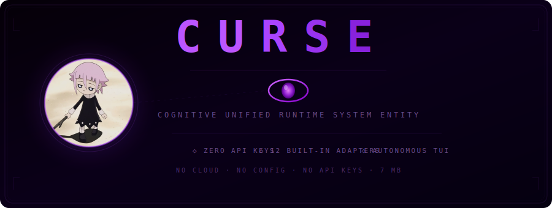

<p align="center">
  
</p>

<p align="center">
  <b>Autonomous terminal entity for software engineering</b><br>
  <sub>single native binary • Windows / macOS / Linux • zero API keys</sub>
</p>

---

## Install (One Command)

### Linux / macOS
```bash
curl -fsSL https://raw.githubusercontent.com/M523zappin/Curse-Core/main/scripts/install.sh | bash
```

### Windows (PowerShell)
```powershell
iex "& { $(irm https://raw.githubusercontent.com/M523zappin/Curse-Core/main/scripts/install.ps1) }"
```

### Build from Source
```bash
git clone https://github.com/M523zappin/Curse-Core.git
cd Curse-Core
go build -o curse ./cmd/dashboard/
```

---

## Quick Start

```bash
curse
```

Then just type what you want:

```
>>> create a REST API handler for users in Go
>>> add unit tests for authentication
>>> implement JWT middleware
>>> write a Dockerfile
```

No API keys needed. No cloud setup. Works 100% offline.

---

## Features

- **32 Code Templates** - Go, Python, TypeScript, DevOps (works offline)
- **Smart Auto-Detection** - Picks the right tools automatically
- **Terminal UI** - Beautiful TUI with syntax highlighting
- **Git Integration** - Tracks all changes with SHA256 chain
- **Review System** - Approve/reject file changes before they happen

---

## Keybindings

| Key | Action |
|-----|--------|
| Tab | Cycle models |
| Ctrl+M | Model browser |
| Ctrl+K | Command palette |
| Ctrl+P | Pause/Resume |
| Up/Down | Navigate |
| Enter | Execute |
| Esc | Close/Cancel |

---

## Adapters

SmartCode is the default and works offline. Optional cloud AI:

| Adapter | Type |
|---------|------|
| smartcode | 100% offline, 32 templates |
| ollama | Local LLM |
| openai-compatible | Any OpenAI-compatible API |

---

## Architecture

```
cmd/dashboard/       Entry point
internal/
├── gateway/         Model adapters
├── dashboard/       Terminal UI
├── engine/          Execution loop
├── consciousness/   Learning system
└── ...
```

---

## Security

- Zero API keys required
- Sandbox for file changes
- SHA256 event chain
- Human approval for actions

---

## License

MIT
