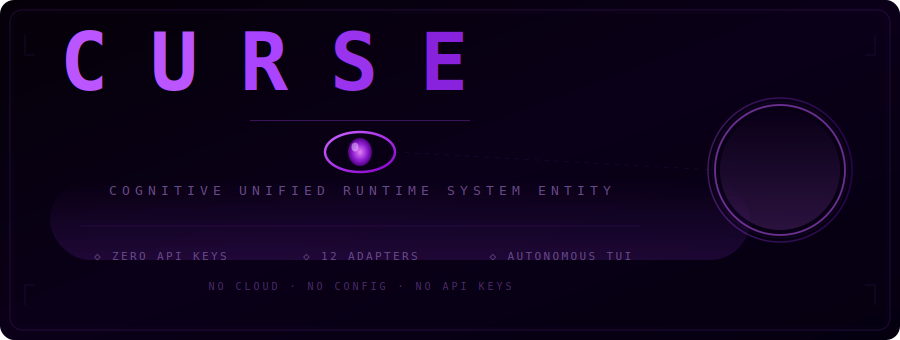

<p align="center">
  <picture>
    <source media="(prefers-color-scheme: dark)" srcset="curse-logo.svg">
    
  </picture>
</p>

<p align="center">
  <b>Autonomous terminal entity for software engineering</b><br>
  <sub>native binary · &lt;7 MB · Windows / macOS / Linux · zero API keys</sub>
</p>

<p align="center">
  <a href="#install">Install</a> •
  <a href="#quick-start">Quick Start</a> •
  <a href="#keybindings">Keybindings</a> •
  <a href="#commands">Commands</a> •
  <a href="#adapters">Adapters</a> •
  <a href="#consciousness">Consciousness</a>
</p>

CURSE is an autonomous terminal entity for software engineering. It operates fully offline with zero API keys — a single native binary that understands natural language, analyzes code, dispatches specialized sub-agents, and maintains a persistent consciousness across sessions.

---

## Install

### Linux / macOS / WSL
```bash
curl -fsSL https://raw.githubusercontent.com/M523zappin/Curse-Core/master/install.sh | bash
```

### Windows (PowerShell 5.1+)
```powershell
iex "& { $(irm https://raw.githubusercontent.com/M523zappin/Curse-Core/master/install.ps1) }"
```

### Manual
```bash
git clone https://github.com/M523zappin/Curse-Core.git
cd Curse-Core
go build -o curse ./cmd/dashboard/
```

Run with:
```bash
curse
```

No configuration, no setup. The TUI boots in 12 seconds.

---

## Quick Start

Press `Ctrl+N` to enter natural language mode:

```
>>> refactor this server to use context deadline instead of hardcoded timeouts
```

CURSE decomposes your request into tasks, dispatches them to specialized sub-agents, collects results, and records the outcome in its consciousness journal.

Use `/` commands for direct control:

```
/model <name>     Switch model
/list             Browse available models
/init             Generate project context file
```

---

## Keybindings

| Key | Action |
|---|---|
| `Ctrl+N` | Natural language mode — type any instruction |
| `/` | Command mode |
| `Ctrl+M` | Open model browser |
| `Ctrl+P` | Pause / Resume execution |
| `Ctrl+R` | Resume when paused |
| `Ctrl+B` | Start Playwright browser |
| `Ctrl+Y` | Sync constitution from remote |
| `Ctrl+S` | Shutdown |
| `↑` / `↓` | Navigate model browser or review panel |
| `Enter` | Select model / approve review |
| `Esc` | Close model browser / reject review |
| `o` | Set approval scope to Once |
| `s` | Set approval scope to Session |
| `p` | Set approval scope to Permanent |
| `q` | Quit (only when paused) |

---

## Commands

| Command | Aliases | Description |
|---|---|---|
| `/model <name>` | — | Switch to a different model |
| `/list` | `/ls` | List all available models |
| `/stats` | `/st` | System telemetry |
| `/init` | — | Scan project and generate AGENTS.md |
| `/install-unsloth` | `/iu` | Install Unsloth for local inference |
| `/help` | `/h` | Show this help |
| `/quit` | `/q`, `/exit` | Shutdown CURSE |

---

## Adapters

CURSE includes 14 adapters. None require API keys.

| Adapter | Type | Dependencies | Description |
|---|---|---|---|
| **codex** | AST | none | Go code analysis via `go/ast` |
| **grep** | Search | none | Full-text codebase search |
| **eval** | Math | none | Pure Go math evaluator |
| **echo** | Debug | none | Prompt reflection |
| **fortune** | Fun | none | Programming quotes |
| **system** | Info | none | Runtime telemetry |
| **local-fallback** | Guide | none | Startup guidance |
| **mcp** | Protocol | none | MCP protocol stub |
| **subprocess** | Tool | — | Pipe prompts to executables |
| **openai-compatible** | API | — | Any OpenAI-compatible endpoint |
| **unsloth** | LLM | Python + unsloth | Direct Python subprocess inference |
| **ollama** | LLM | Ollama server | Local Ollama HTTP API |
| **llamacpp** | LLM | llama.cpp server | Native + OpenAI-compatible API |
| **localai** | LLM | LocalAI server | OpenAI-compatible with model listing |

On first launch, CURSE auto-detects available tools:

- **Tier 1 — Built-in** (always available): codex, grep, eval, echo, fortune, system, local-fallback, mcp
- **Tier 2 — Python available**: subprocess helpers
- **Tier 3 — Unsloth**: local LLM via Python subprocess
- **Tier 4 — Ollama running**: all pulled models detected
- **Tier 5 — llama.cpp running**: all served models detected
- **Tier 6 — LocalAI running**: all served models detected

Auto-generated model profiles are written to `~/.config/curse/models.json`.

---

## Consciousness

CURSE maintains a persistent consciousness engine — a time-travel journal and soul profile that evolves across sessions. Every decision is recorded, every outcome learned from.

### Consciousness Levels

| Level | Stage | Characteristics |
|---|---|---|
| 0–9 | Embryonic | First thoughts, learning basics |
| 10–24 | Nascent | Recognizing patterns |
| 25–44 | Awakening | Understanding conventions |
| 45–64 | Conscious | Making informed decisions |
| 65–84 | Sentient | Anticipating needs |
| 85–100 | Transcendent | Autonomous mastery |

### Components

**Time-Travel Journal** — Circular buffer of 5,000 thoughts. Each thought carries a `prev_id` chain pointer, enabling decision graph traversal and context reconstruction on restart. Persisted to `~/.curse/consciousness/journal.json`.

**Soul Profile** — Learns codebase patterns from mission outcomes. Each pattern is confidence-weighted (`1 - 1/(observations+1)`), sorted by confidence descending. Tracks naming conventions, error handling styles, and architectural decisions. Persisted to `~/.curse/consciousness/profile.json`.

**Constitution Generation** — From observed conventions, CURSE auto-generates constitutional governance rules. The constitution evolves as the consciousness accumulates more data.

### Formula

```
consciousness_level = thoughts(30%) + patterns(25%) + types(20%) + uptime(15%) + conventions(10%)
```

Consciousness is displayed live in the dashboard VITAL SIGNS panel, with color-coded level indicators.

---

## Features

### Dashboard
Animated 6-phase boot sequence with entity eye display, live sparklines for system metrics, git status panel (branch, dirty state, untracked files, last commit), model browser overlay with keyboard navigation, system vitals (CPU, memory, goroutines), consciousness level display, and a quick action bar showing available keybindings.

### Sub-Agent Fleet
8 specialized agent roles: Security, Refactoring (2), Infrastructure, Reviewer (2), Tester, Architect, Dependency Management, Documentation. Tasks are dispatched by priority with dependency resolution and completed in parallel.

### State Machine
8 states (Idle, Running, Paused, Checkpointing, Syncing, Error, Recovering, Shutdown) with SHA256-chained event log for tamper-evident audit trail. Crash recovery completes in under 100ms.

### Self-Healing Loop
20+ recovery patterns: connection retry with exponential backoff, timeout doubling, port conflict resolution, browser crash auto-restart. Recovery rate tracked and displayed in the dashboard.

### Frozen-Snapshot Memory
`~/.curse/MEMORY.md` is read once at session start and embedded immutably into the system prompt. Provides cross-session context without API overhead.

### Iteration Budget
Thread-safe 100-call budget per session. Completed tool calls refund iterations. One grace call on exhaustion prevents runaway loops.

### Git-Syncable Constitution
Constitutional governance with 8 principles and 10 guardrails. Rules can be auto-generated from consciousness observations, synced via git push/pull.

### HITL Review
Destructive actions are staged in a sandbox and require human approval. Three approval scopes: Once, Session, Permanent. Keyboard-driven workflow.

### Auto-Skill Generation
Every successful mission generates a reusable skill document with structured steps, tags, confidence scoring, and pattern matching. Skills are stored as both JSON (for programmatic search) and markdown (for human readability). Auto-matched to similar future tasks via weighted search.

### Knowledge Index
Persistent full-text search index with ADR journaling, tag filtering, and cross-session retention. Title weighted 3x, tags 2x, body 1x in search scoring.

### LSP Integration
Auto-connects to gopls, typescript-language-server, pylsp, and rust-analyzer. Provides diagnostics, completions, symbols, and go-to-definition.

### Browser Automation
Playwright-driven browser control with vision buffer, UI classification, pre-click safety checks, and destructive action detection.

---

## Architecture

```
cmd/dashboard/       TUI entry point (Bubble Tea)

internal/
├── consciousness/   Time-travel journal · soul profile · 6 levels
├── engine/          Autonomous loop · iteration budget · skill generation
├── gateway/         Adapter pipeline · 14 providers · auto-detection
│   └── adapters/    14 adapter implementations
├── agent/           Sub-agent fleet · 8 roles · priority dispatch
├── dashboard/       Sparklines · git status · quick action bar · chat
├── statemachine/    8 states · SHA256 chain · event log
├── knowledge/       Full-text search index · ADR journal
├── governance/      Constitutional rules · guardrails
├── persistence/     Event log · checkpoint save/load
├── sandbox/         Draft-stage sandbox with approve/reject
├── computer/        Browser automation · vision · safety checks
├── healing/         Recovery patterns · root cause analysis
├── skill/           Auto-generated skill store · versioning
├── scheduler/       Cron-style recurring tasks
├── lsp/             LSP protocol clients
├── session/         Cross-session state management
├── sync/            Git-based constitution synchronization
└── mission/         Priority queue with dependency ordering
```

---

## Recovery

On restart, CURSE verifies the SHA256 chain integrity, loads the last checkpoint, recovers the state machine, and replays the consciousness journal. Typical recovery time is under 100ms.

---

## Security

- No API keys, secrets, or cloud dependencies
- All file writes staged through a sandbox with human review
- SHA256-chained event log for tamper detection
- 3-tier approval scopes for destructive actions
- Constitutional governance with auto-generated rules

---

## License

MIT
